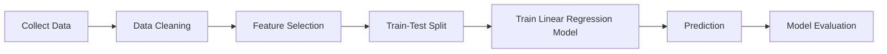
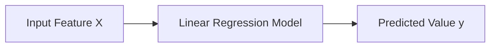
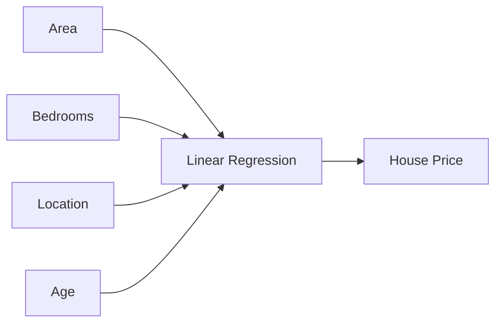
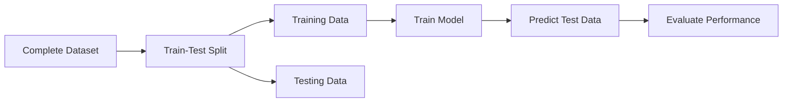
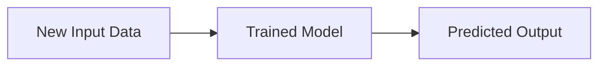
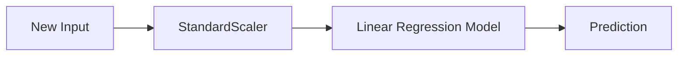
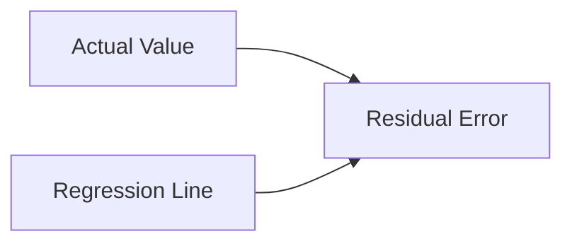

# 📈 Linear Regression - Complete Theory Notes

<p align="center">


</p>

---

# 📌 Overview

Welcome to my **Linear Regression Theory Notes**.

These notes summarize everything I learned while studying **Linear Regression**, one of the most fundamental supervised machine learning algorithms.

Instead of only focusing on implementation, these notes explain the theory, mathematical intuition, practical workflow, evaluation metrics, and important interview concepts.

By the end of these notes, you will understand:

- What is Machine Learning?
- What is Supervised Learning?
- What is Regression?
- Simple Linear Regression
- Multiple Linear Regression
- Model Training
- Prediction
- Feature Standardization
- Evaluation Metrics
- Practical Implementation using Scikit-Learn

---

# 📑 Table of Contents

- 📌 Overview
- 🤖 What is Machine Learning?
- 🎯 Types of Machine Learning
- 📈 What is Linear Regression?
- 📊 Types of Linear Regression
- 📐 Mathematical Equations
- 📉 Assumptions of Linear Regression
- 🏋️ Model Training
- 🔮 Prediction
- 📊 Standardization
- 📈 Visualization
- 📋 Model Parameters
- 📊 Evaluation Metrics
- 💡 Best Practices
- ⚠️ Common Mistakes
- ❓ Interview Questions
- 🎯 Key Takeaways

---

# 🤖 What is Machine Learning?

Machine Learning is a branch of Artificial Intelligence (AI) that enables computers to learn patterns from data and make predictions or decisions without being explicitly programmed for every task.

Instead of writing fixed rules, we provide data to the model, and the algorithm learns the relationship between inputs and outputs.

---

## 🎯 Goal of Machine Learning

The primary objective of Machine Learning is to build models that can generalize well to unseen data.

Examples include:

- Predicting house prices
- Detecting spam emails
- Recognizing handwritten digits
- Predicting stock prices
- Recommending movies
- Medical diagnosis

---

# 📊 Types of Machine Learning

Machine Learning is mainly divided into four categories.

| Type | Description |
|------|-------------|
| Supervised Learning | Learns from labeled data |
| Unsupervised Learning | Learns patterns without labels |
| Semi-Supervised Learning | Combination of labeled and unlabeled data |
| Reinforcement Learning | Learns by interacting with an environment |

---

## Supervised Learning

Linear Regression belongs to **Supervised Learning**.

In supervised learning,

- Input Features (X) are provided.
- Correct Output (y) is also provided.

The model learns the relationship between them.

Example

```
Study Hours  →  Exam Score

Experience   →  Salary

Area         →  House Price
```

---

# 📈 What is Linear Regression?

Linear Regression is one of the simplest supervised machine learning algorithms used for predicting **continuous numerical values**.

It attempts to establish a linear relationship between one or more input variables (features) and the target variable.

---

## Definition

> Linear Regression fits the **best possible straight line** through the data points by minimizing prediction errors.

This straight line is known as the **Regression Line** or **Best Fit Line**.

---

## Real-World Examples

Linear Regression can be used for:

- Predicting salary based on years of experience.
- Predicting house prices using area.
- Predicting sales based on advertising budget.
- Predicting electricity consumption.
- Predicting medical insurance charges.
- Predicting student marks based on study hours.

---

# 🧠 Why is it Called "Regression"?

Regression refers to predicting a **continuous numerical value**.

Examples:

✔ House Price → ₹25,00,000

✔ Temperature → 35.2°C

✔ Salary → ₹12,50,000

✔ Exam Marks → 87.5

Unlike classification, regression does **not** predict categories.

---

# 📊 Regression vs Classification

| Regression | Classification |
|------------|----------------|
| Predicts Continuous Values | Predicts Categories |
| Example: House Price | Example: Spam Detection |
| Output: 85.7 | Output: Yes / No |
| Uses Regression Algorithms | Uses Classification Algorithms |

---

# 🔄 Linear Regression Workflow



---

# 📚 Learning Objectives

After completing these notes, you should be able to:

- Explain Linear Regression.
- Differentiate between Regression and Classification.
- Understand supervised learning.
- Implement Linear Regression using Scikit-Learn.
- Train and evaluate regression models.
- Interpret coefficients and intercept.
- Predict values for unseen data.

---

# 💡 Key Insight

Linear Regression works best when the relationship between the input variables and the target variable is approximately **linear**.

If the relationship is highly nonlinear, other algorithms such as Decision Trees, Random Forests, or Neural Networks may provide better performance.

---

# 🎯 Key Takeaways

✔ Linear Regression is a supervised learning algorithm.

✔ It predicts continuous numerical values.

✔ It learns a linear relationship between features and the target.

✔ It is one of the most important foundational algorithms in Machine Learning.

------

# 📊 Types of Linear Regression

Linear Regression is broadly classified into two types:

1. **Simple Linear Regression**
2. **Multiple Linear Regression**

Both algorithms predict continuous numerical values, but they differ in the number of input features used.

| Type | Number of Features | Example |
|------|--------------------|---------|
| Simple Linear Regression | One | Salary Prediction using Experience |
| Multiple Linear Regression | More than One | House Price Prediction |

---

# 1️⃣ Simple Linear Regression

## 📌 Definition

Simple Linear Regression is a supervised learning algorithm that uses **one independent variable (feature)** to predict a **continuous dependent variable (target).**

It attempts to find the best straight line that represents the relationship between the input feature and the output.

---

## 🎯 Goal

The goal is to learn the relationship between:

```
Input (X)

↓

Target (y)
```

and use this relationship to predict future values.

---

## 📐 Mathematical Equation

The equation of Simple Linear Regression is

\[
y = \theta_0 + \theta_1x
\]

Where

| Symbol | Meaning |
|---------|---------|
| \(y\) | Predicted Value |
| \(x\) | Independent Variable |
| \(\theta_0\) | Intercept |
| \(\theta_1\) | Slope (Coefficient) |

---

## 📖 Understanding the Equation

Suppose the model learns

\[
y = 5 + 2x
\]

If

```
x = 10
```

then

\[
y = 5 + (2 × 10)
\]

\[
y = 25
\]

The predicted value becomes

```
25
```

---

## 📊 Graphical Representation



Another way to visualize it

```
y

↑

|                     ●

|                 ●

|             ●

|         ●

|     ●

| ●________________________→ x
```

The straight line is called the **Regression Line** or **Best Fit Line**.

---

# 📌 Real-World Examples

Simple Linear Regression can be used for

- Predicting salary using years of experience.
- Predicting marks using study hours.
- Predicting crop yield using rainfall.
- Predicting electricity consumption using temperature.

---

# 📈 Components of the Regression Line

The regression line consists of two important parameters.

## 1️⃣ Intercept

The intercept represents the predicted value when

```
x = 0
```

Example

If

\[
y = 10 + 4x
\]

then

```
Intercept = 10
```

---

## 2️⃣ Slope (Coefficient)

The slope indicates how much the target changes when the feature increases by one unit.

Example

\[
y = 10 + 4x
\]

Here

```
Slope = 4
```

Meaning

Every increase of

```
1 unit in x
```

increases

```
y by 4 units.
```

---

# 🏠 Example

Suppose

```
Experience

↓

Salary
```

Dataset

| Experience | Salary |
|------------|---------|
| 1 | 30,000 |
| 2 | 40,000 |
| 3 | 50,000 |
| 4 | 60,000 |

The model learns the relationship

```
Experience

↓

Salary
```

and predicts salaries for new employees.

---

# 2️⃣ Multiple Linear Regression

## 📌 Definition

Multiple Linear Regression extends Simple Linear Regression by using **two or more independent variables** to predict the target variable.

Instead of relying on a single feature, the model considers multiple factors simultaneously.

---

## 📐 Mathematical Equation

\[
y=\theta_0+\theta_1x_1+\theta_2x_2+\cdots+\theta_nx_n
\]

Where

| Symbol | Meaning |
|---------|---------|
| \(x_1\) | First Feature |
| \(x_2\) | Second Feature |
| \(x_n\) | nth Feature |
| \(\theta_1\) | Coefficient of \(x_1\) |
| \(\theta_2\) | Coefficient of \(x_2\) |
| \(\theta_n\) | Coefficient of \(x_n\) |

---

## 🏠 Example

Predicting house price using

- Area
- Number of Bedrooms
- Age of House
- Parking Space
- Location Score

Instead of relying only on area, the model learns from multiple features.

---

## 📊 Workflow



---

# 📈 Why Multiple Linear Regression Performs Better?

Using multiple features allows the model to learn more information about the problem.

Instead of

```
Area

↓

Price
```

the model learns

```
Area

Bedrooms

Parking

Location

↓

Price
```

which usually leads to more accurate predictions.

---

# 📉 Assumptions of Linear Regression

Linear Regression performs well when the following assumptions are approximately satisfied.

---

## 1️⃣ Linear Relationship

The relationship between input features and the target should be approximately linear.

---

## 2️⃣ Independence

Training examples should be independent of one another.

---

## 3️⃣ Homoscedasticity

The variance of residual errors should remain approximately constant.

---

## 4️⃣ Normal Distribution of Errors

Residual errors should approximately follow a normal distribution.

---

## 5️⃣ Low Multicollinearity

Independent variables should not be highly correlated with each other.

High multicollinearity makes it difficult to estimate reliable coefficients.

---

# 📌 Simple vs Multiple Linear Regression

| Feature | Simple LR | Multiple LR |
|----------|-----------|-------------|
| Number of Features | One | More than One |
| Equation | \(y=\theta_0+\theta_1x\) | \(y=\theta_0+\theta_1x_1+\cdots+\theta_nx_n\) |
| Complexity | Low | Moderate |
| Accuracy | Lower | Usually Higher |
| Example | Salary Prediction | House Price Prediction |

---

# 💡 Key Notes

- ✔ Simple Linear Regression uses only one feature.
- ✔ Multiple Linear Regression uses multiple features.
- ✔ Both predict continuous numerical values.
- ✔ Multiple Linear Regression generally provides better predictions when relevant features are available.
- ✔ Understanding coefficients helps explain the influence of each feature on the target variable.

---

# 🎯 Key Takeaways

- Linear Regression models the relationship between input variables and a continuous output.
- The slope measures the impact of a feature on the prediction.
- The intercept represents the baseline prediction.
- Multiple Linear Regression extends the model to multiple input features.
- Choosing informative features often improves predictive performance.

------

# 🚂 Train-Test Split

Before training any Machine Learning model, the dataset should be divided into two parts:

1. **Training Dataset**
2. **Testing Dataset**

The training data is used to teach the model, while the testing data is used to evaluate how well the model performs on unseen data.

## 🔄 Workflow



---

## 📌 Why Train-Test Split?

Without a test dataset, we cannot determine whether the model has learned useful patterns or has simply memorized the training data.

### Benefits

- Prevents overfitting
- Measures model generalization
- Evaluates performance on unseen data
- Provides an unbiased estimate of model accuracy

---

## 📦 Components

### X_train

Contains the independent variables (features) used for training the model.

Example

```
Study Hours

Experience

Area

Bedrooms
```

---

### y_train

Contains the target values corresponding to the training features.

Example

```
Salary

House Price

Exam Marks
```

---

### X_test

Contains unseen feature values used for testing the trained model.

---

### y_test

Contains the actual target values used to compare with the model's predictions.

---

## 💻 Scikit-Learn Implementation

```python
from sklearn.model_selection import train_test_split

X_train, X_test, y_train, y_test = train_test_split(
    X,
    y,
    test_size=0.2,
    random_state=42
)
```

### Parameters

| Parameter | Description |
|-----------|-------------|
| `X` | Input features |
| `y` | Target variable |
| `test_size=0.2` | 20% of data for testing |
| `random_state=42` | Ensures reproducible results |

---

# 🏋️ Model Training

Once the dataset is split, the model is trained using the training data.

```python
reg.fit(X_train, y_train)
```

---

## 🔍 What does `fit()` do?

The `fit()` method is responsible for learning the relationship between the input features (`X`) and the target variable (`y`).

During training, the model:

- Learns the best-fit regression line
- Computes the coefficients (slopes)
- Computes the intercept
- Minimizes prediction error

---

## 🎯 Workflow

```mermaid
graph LR

A[X_train]

B[y_train]

A-->C[fit()]

B-->C

C-->D[Trained Linear Regression Model]
```

---

# 🔮 Model Prediction

After training, the model is ready to predict values for unseen data.

```python
y_pred = reg.predict(X_test)
```

---

## 🔍 What does `predict()` do?

The `predict()` method uses the learned regression equation to estimate the target values for new input data.

---

## Prediction Workflow



---

## Example

Suppose the trained model learned

\[
y = 10 + 5x
\]

If

```
x = 8
```

Prediction becomes

\[
y = 10 + (5 × 8)
\]

\[
y = 50
\]

---

# 📊 Standardization

## 📌 What is Standardization?

Standardization transforms numerical features so that they have:

- Mean = 0
- Standard Deviation = 1

This helps ensure that all features contribute equally during model training.

---

## 🎯 Why is Standardization Important?

Suppose we have two features:

| Feature | Value |
|----------|-------|
| Age | 25 |
| Salary | 8,50,000 |

Because salary has much larger values, it can dominate the learning process.

Standardization solves this issue.

---

## 📐 Formula

\[
z=\frac{x-\mu}{\sigma}
\]

Where

| Symbol | Meaning |
|---------|---------|
| \(x\) | Original Value |
| \(\mu\) | Mean |
| \(\sigma\) | Standard Deviation |
| \(z\) | Standardized Value |

---

## 💻 Scikit-Learn Implementation

```python
from sklearn.preprocessing import StandardScaler

scaler = StandardScaler()

X_train_scaled = scaler.fit_transform(X_train)

X_test_scaled = scaler.transform(X_test)
```

---

## 🚨 Important Rule

✔ Fit only on training data.

```python
scaler.fit(X_train)
```

✔ Transform both training and testing data.

```python
X_train_scaled = scaler.transform(X_train)

X_test_scaled = scaler.transform(X_test)
```

❌ Never fit the scaler on the testing dataset.

---

## Why?

If we fit the scaler on the test data, information from the test set leaks into the training process.

This is known as **Data Leakage**.

---

# 📈 Data Visualization

Visualization helps us understand how well the regression line fits the data.

```python
plt.scatter(X_train, y_train)

plt.plot(X_train, reg.predict(X_train), color='red')
```

---

## 📌 Scatter Plot

The scatter plot displays the actual data points.

```
●

●

●

●
```

Each point represents one observation.

---

## 📌 Regression Line

The red line represents the predicted relationship learned by the model.

A good regression model places this line as close as possible to all data points.

---

# 📋 Model Parameters

After training, the Linear Regression model stores useful information.

---

## 1️⃣ Coefficients

```python
reg.coef_
```

### Meaning

Coefficients indicate how much the target variable changes when a feature increases by one unit.

Example

```
Coefficient = 4.5
```

Means

Increasing the feature by one unit increases the predicted target by **4.5 units**.

---

## 2️⃣ Intercept

```python
reg.intercept_
```

The intercept is the predicted target value when every input feature equals zero.

Example

```
Intercept = 12.8
```

This is the starting point of the regression line.

---

# 📊 Interpretation Example

Suppose

```python
Coefficient = 2500

Intercept = 15000
```

Equation

\[
Salary = 15000 + 2500 \times Experience
\]

If

```
Experience = 4
```

Prediction

\[
Salary = 15000 + (2500 × 4)
\]

\[
Salary = 25000
\]

---

# 🔮 Prediction on New Data

Predicting unseen data is one of the primary goals of Machine Learning.

Example

```python
new_data = [[90]]

new_data_scaled = scaler.transform(new_data)

prediction = reg.predict(new_data_scaled)

print(prediction)
```

---

## 📌 Important Note

Always apply the same preprocessing steps to new data that were applied during training.

If the training data was standardized, new data must also be standardized before prediction.

---

## 🔄 Complete Prediction Pipeline



---

# 💡 Best Practices

✔ Always split the dataset before training.

✔ Fit preprocessing objects only on the training data.

✔ Transform testing and new data using the same fitted scaler.

✔ Visualize your data whenever possible.

✔ Interpret coefficients carefully.

✔ Evaluate the model using multiple metrics rather than relying on a single score.

---

# ⚠️ Common Mistakes

❌ Training on the entire dataset without a train-test split.

❌ Applying `fit_transform()` on the test dataset.

❌ Forgetting to standardize new input data.

❌ Using different preprocessing for training and prediction.

❌ Evaluating the model only on training data.

---

# 🎯 Key Takeaways

- `train_test_split()` creates separate training and testing datasets.
- `fit()` trains the model by learning the relationship between features and the target.
- `predict()` estimates target values for unseen data.
- Standardization ensures features are on a comparable scale.
- `coef_` and `intercept_` explain how the model makes predictions.
- Proper preprocessing and evaluation are essential for building reliable regression models.

------

# 📊 Model Evaluation Metrics

After training a Linear Regression model, we need to evaluate how well it performs on unseen data.

Scikit-Learn provides several evaluation metrics for regression models.

```python
from sklearn.metrics import (
    mean_absolute_error,
    mean_squared_error,
    r2_score
)
```

---

# 1️⃣ Mean Absolute Error (MAE)

## 📌 Definition

Mean Absolute Error calculates the average absolute difference between the actual values and the predicted values.

### Formula

\[
MAE=\frac{1}{n}\sum_{i=1}^{n}|y_i-\hat{y_i}|
\]

Where

- \(y_i\) = Actual Value
- \(\hat{y_i}\) = Predicted Value

---

### Example

| Actual | Predicted |
|---------|-----------|
| 100 | 95 |
| 200 | 190 |
| 300 | 310 |

Errors

```
5

10

10
```

Average Error

```
MAE = 8.33
```

### Advantages

✔ Easy to understand

✔ Less affected by outliers

✔ Measured in the original unit

---

# 2️⃣ Mean Squared Error (MSE)

## 📌 Definition

MSE calculates the average of the squared differences between actual and predicted values.

### Formula

\[
MSE=\frac{1}{n}\sum_{i=1}^{n}(y_i-\hat{y_i})^2
\]

---

### Why Square the Error?

Squaring gives larger penalties to larger mistakes.

Example

```
Error = 2

Squared Error = 4
```

```
Error = 10

Squared Error = 100
```

Large errors influence the metric much more.

---

### Advantages

✔ Differentiable

✔ Commonly used during model optimization

✔ Penalizes large prediction errors

---

# 3️⃣ Root Mean Squared Error (RMSE)

## 📌 Definition

RMSE is the square root of MSE.

### Formula

\[
RMSE=\sqrt{MSE}
\]

---

### Why Use RMSE?

RMSE returns the error in the **same unit as the target variable**, making interpretation easier.

Example

If the target variable is measured in dollars,

RMSE is also measured in dollars.

---

# 4️⃣ R² Score (Coefficient of Determination)

## 📌 Definition

The R² Score measures how well the regression model explains the variation in the target variable.

### Formula

\[
R^2=1-\frac{SS_{Residual}}{SS_{Total}}
\]

---

### Interpretation

| R² Score | Meaning |
|-----------|---------|
| 1.0 | Perfect Prediction |
| 0.9 | Excellent Model |
| 0.8 | Good Model |
| 0.6 | Moderate Model |
| 0 | Model performs no better than predicting the mean |
| Negative | Worse than predicting the mean |

---

## 📊 Comparison of Metrics

| Metric | Lower is Better? | Unit |
|----------|------------------|------|
| MAE | ✅ Yes | Original Unit |
| MSE | ✅ Yes | Squared Unit |
| RMSE | ✅ Yes | Original Unit |
| R² Score | ❌ Higher is Better | No Unit |

---

# 📉 Residual Errors

Residual Error is the difference between the actual value and the predicted value.

\[
Residual = Actual - Predicted
\]

Smaller residuals indicate better model performance.

---

# 📈 Visualizing Residuals



Residual plots help determine whether the assumptions of Linear Regression are satisfied.

---

# 🌍 Real-World Applications

Linear Regression is widely used across many industries.

## 🏠 House Price Prediction

Predict property prices based on:

- Area
- Number of Bedrooms
- Location
- Age of Property

---

## 💰 Salary Prediction

Estimate employee salaries using:

- Years of Experience
- Education Level
- Skills

---

## 📈 Sales Forecasting

Businesses predict future sales based on historical trends.

---

## 🏥 Healthcare

Predict:

- Medical Expenses
- Insurance Charges
- Hospital Stay Duration

---

## 🌦 Weather Forecasting

Estimate:

- Temperature
- Rainfall
- Humidity

---

## 🚗 Automobile Industry

Predict:

- Vehicle Prices
- Fuel Efficiency
- Maintenance Cost

---

# 💡 Best Practices

✔ Understand your dataset before training.

✔ Handle missing values carefully.

✔ Split data into training and testing sets.

✔ Standardize features when required.

✔ Interpret coefficients instead of treating the model as a black box.

✔ Evaluate the model using multiple metrics.

✔ Check Linear Regression assumptions.

✔ Visualize the data before modeling.

---

# ⚠️ Common Mistakes

❌ Using Linear Regression for classification problems.

❌ Ignoring outliers.

❌ Forgetting to preprocess new data.

❌ Training and testing on the same dataset.

❌ Assuming correlation always implies causation.

❌ Ignoring multicollinearity.

❌ Evaluating the model using only one metric.

---

# ❓ Frequently Asked Interview Questions

### 1. What is Linear Regression?

A supervised learning algorithm used to predict continuous numerical values.

---

### 2. Difference between Regression and Classification?

Regression predicts numerical values.

Classification predicts categories.

---

### 3. What is the role of `fit()`?

It trains the model by learning the relationship between input features and the target.

---

### 4. What is the role of `predict()`?

It generates predictions for unseen data.

---

### 5. What is the difference between MAE and RMSE?

- MAE treats all errors equally.
- RMSE penalizes larger errors more heavily.

---

### 6. Why do we standardize data?

To ensure that all features contribute equally during model training.

---

### 7. What is the difference between Simple and Multiple Linear Regression?

Simple Linear Regression uses one feature, whereas Multiple Linear Regression uses two or more features.

---

### 8. What is the intercept?

The predicted value when all input features are zero.

---

### 9. What is a coefficient?

It represents the expected change in the target variable for a one-unit increase in the corresponding feature, assuming other features remain constant.

---

### 10. When should Linear Regression not be used?

- Highly nonlinear relationships
- Classification problems
- Severe multicollinearity
- Significant violations of regression assumptions

---

# 📝 Quick Revision

```text
Linear Regression

↓

Predicts Continuous Values

↓

Simple or Multiple

↓

Train-Test Split

↓

fit()

↓

predict()

↓

StandardScaler (Optional)

↓

Evaluate

↓

MAE

MSE

RMSE

R² Score
```

---

# 🎯 Key Takeaways

- ✔ Linear Regression is one of the simplest supervised learning algorithms.
- ✔ It predicts continuous numerical values.
- ✔ Simple Linear Regression uses one feature.
- ✔ Multiple Linear Regression uses multiple features.
- ✔ `fit()` trains the model.
- ✔ `predict()` generates predictions.
- ✔ `coef_` stores feature coefficients.
- ✔ `intercept_` stores the bias term.
- ✔ MAE, MSE, RMSE, and R² are the most common evaluation metrics.
- ✔ Proper preprocessing and evaluation are essential for building reliable regression models.

---

# 📚 References

- 📖 Scikit-Learn Documentation
- 📖 Python Documentation
- 📖 Hands-On Machine Learning with Scikit-Learn, Keras & TensorFlow – Aurélien Géron
- 📖 Introduction to Statistical Learning (ISLR)

---

# 🎓 Conclusion

Linear Regression is one of the most important algorithms in Machine Learning and serves as the foundation for understanding many advanced regression techniques.

Through these notes, I explored the theory, mathematical intuition, implementation, preprocessing, visualization, model evaluation, and practical applications of Linear Regression.

These concepts have strengthened my understanding of supervised learning and prepared me for more advanced topics such as **Logistic Regression**, **Support Vector Machines**, **Decision Trees**, and **Ensemble Learning**.

---

<div align="center">

## ⭐ If you found these notes helpful, consider starring the repository!

### 🚀 Happy Learning and Keep Building!

**Made with ❤️ as part of my Machine Learning Journey**

</div>
